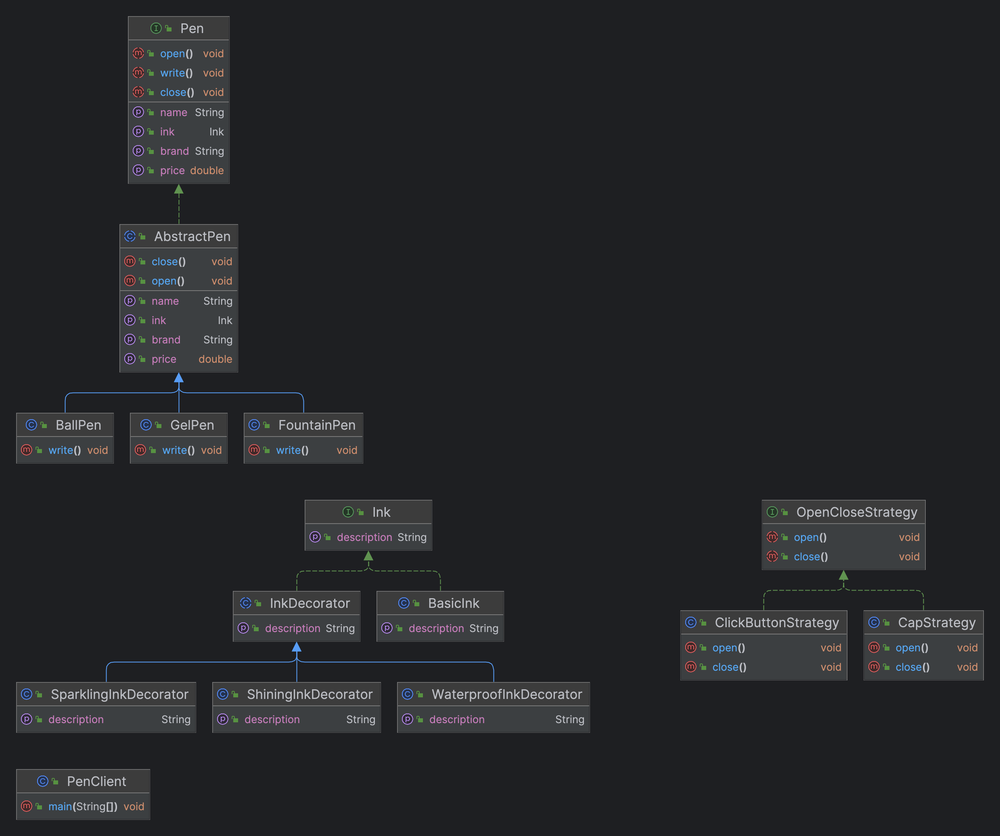

# Design a Pen

## Scope
This project aims to design a flexible, extensible, and clean object-oriented system to model different types of pens, their behaviors, and properties. It addresses the needs of creating various pen types with distinct mechanisms for opening and closing, as well as supporting different ink characteristics.

## Requirements
* Model any physical entity that exhibits writing behavior as a pen.
* Support for different pen types: Gel Pen, Ball Pen, Fountain Pen.
* Gel and Ball pens have refills; Fountain pens do not. Refills contain ink, which has different colors.
* Inks can have properties like shining, sparkling, and waterproof, and an ink may combine several properties.
* Store the brand, name, and price for every pen.
* Pens can be opened or closed using different mechanisms (e.g., cap, click button).
* The system should allow for easy extension to support new pen types, opening mechanisms, or ink properties without significant modifications to existing code.

## Methodology and Design Patterns
### Design Patterns Used
* Strategy Pattern: Used for the opening and closing mechanisms of pens, allowing them to be interchangeable.
* Decorator Pattern: Applied to ink properties, enabling dynamic combination of different ink characteristics.

### Class Design
* Pen Interface: Defines the contract for all pens, promoting polymorphism.
* AbstractPen Class: Provides a common implementation for shared pen attributes and behaviors, leveraging code reuse.
* OpenCloseStrategy Interface: Enables the Strategy pattern for open/close behaviors.
* Ink Interface and Decorators: Facilitate the Decorator pattern for extensible ink properties.

## Class Diagram


## Main Method Example
### Input
The Main class demonstrates creating various pen objects with different configurations:

```
Pen gelPenWithCapAndBlueInk = new GelPen("GelBrand", "GelModel1", 10.99, new CapStrategy(), new BasicInk("Blue"));
Pen ballPenWithClickAndSparklingRedInk = new BallPen("BallBrand", "BallModel1", 8.99, new ClickButtonStrategy(), new SparklingInkDecorator(new BasicInk("Red")));
Pen fountainPenWithCapAndWaterproofShiningBlueInk = new FountainPen("FountainBrand", "FountainModel1", 15.99, new CapStrategy(), new WaterproofInkDecorator(new ShiningInkDecorator(new BasicInk("Blue"))));

// Using the pens
System.out.println("Using gel pen:");
gelPenWithCapAndBlueInk.open();
gelPenWithCapAndBlueInk.write();
gelPenWithCapAndBlueInk.close();

System.out.println("\nUsing ball pen:");
ballPenWithClickAndSparklingRedInk.open();
ballPenWithClickAndSparklingRedInk.write();
ballPenWithClickAndSparklingRedInk.close();

System.out.println("\nUsing fountain pen:");
fountainPenWithCapAndWaterproofShiningBlueInk.open();
fountainPenWithCapAndWaterproofShiningBlueInk.write();
fountainPenWithCapAndWaterproofShiningBlueInk.close();
```

### Output
```
Using gel pen:
Removing the cap.
Writing with Blue Basic Ink using GelPen
Placing the cap back on.

Using ball pen:
Clicking the button to open.
Writing with Red Basic Ink, Sparkling using BallPen
Clicking the button to retract the pen tip.

Using fountain pen:
Removing the cap.
Writing with Blue Basic Ink, Shining, Waterproof using FountainPen
Placing the cap back on.
```

## Conclusion
This project demonstrates the application of design patterns to achieve a flexible and maintainable codebase. It allows for easy addition and modification of pen types, opening mechanisms, and ink properties, aligning with the principles of object-oriented design and SOLID principles.